# spring-cloud-bookinfo 部署 demo

Spring Cloud microservices demo coppied from Istio Bookinfo


整个微服务应用中包含了 4 个组件

1. productpage 是一个由 react 开发的前端组件。
2. details 是一个 spring-cloud 微服务，提供了书籍详情 API。
3. reviews 是一个 spring-cloud 微服务，提供了基础的书籍评论信息，它还会调用 `ratings` 微服务。
4. ratings 是一个 spring-cloud 微服务，提供了评分数据。

`reviews` 微服务有 3 个版本：

- v1 版本不会调用 `ratings` 服务。
- v2 版本会调用 `ratings` 服务，并使用 1 到 5 个黑色星形图标来显示评分信息。
- v3 版本会调用 `ratings` 服务，并使用 1 到 5 个红色星形图标来显示评分信息。

在 springcloud demo 中我们用到以上的组件有：productpage, details, reviews, ratings，另外还使用了微服务网关的镜像。

下图展示了这个应用的端到端架构。

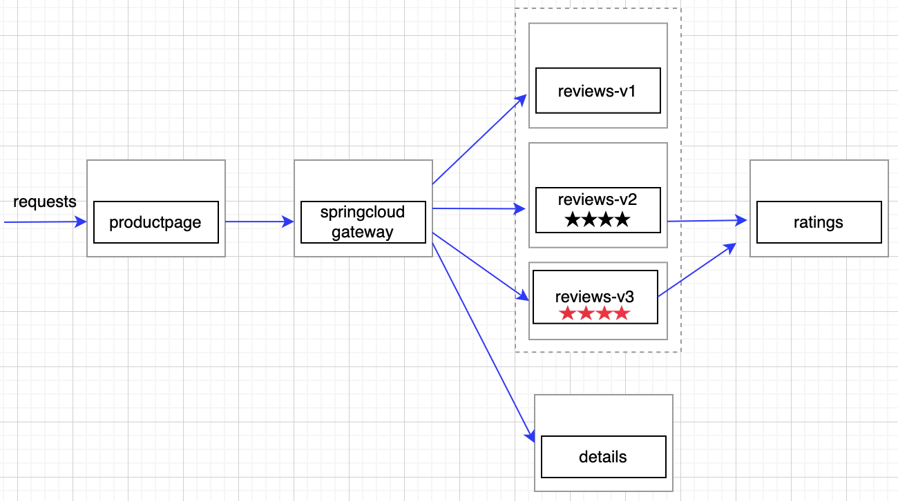

微服务上云，主要分为以下几个步骤：

1. 打包应用：将应用打包成可运行的应用包
2. 制作镜像：docker 根据 Dockerfile 打包成制定镜像
3. 推送镜像：将镜像推送到仓库，部署时到仓库中取镜像
4. 部署应用：将应用部署在 K8s 集群上

打包应用的过程也可写在制作镜像的 Dockerfile 中，以下示例就是采取的这种方式，下面就分为准备镜像、部署应用这两个大步骤操作。


## 准备镜像

前提：在本机上安装 docker ，并建好镜像仓库，以下示例用的镜像仓库使用的 [Docker Hub](https://hub.docker.com/) 镜像仓库。

[参考 BUILD_IMAGES_README](./BUILD_IMAGES_README.md)


## 通过命令行快捷部署

[参考 BUILD_IMAGES_README#Tests](./BUILD_IMAGES_README.md#tests)


## 在 KSE 页面上部署应用

### 在 KSE 上启用 springcloud 组件

**页面方式启用：**

使用 admin 账号登录后 -> 平台管理 -> 集群管理 -> CRD菜单栏 -> 编辑 ClusterConfiguration 中 ks-installer 将 spec.springcloud.enabled 设置为 true，也可在里面对部署的 nacos 参数自由配置，[参数说明](https://github.com/kubesphere/kse-installer/blob/kse-3.3/roles/springcloud/files/springcloud-controller/README.md#nacos)。


**命令行方式启用：**

```sh
kubectl -n kubesphere-system edit cc ks-installer
# 然后将 spec.springcloud.enabled 设置为 true，也可在里面对部署的 nacos 参数自由配置
```


### 部署配置 bookinfo

前提：在 ks 上安装后[创建企业空间、项目、用户和平台角色](https://kubesphere.com.cn/docs/quick-start/create-workspace-and-project/)再进行下面操作。

此示例中创建的企业空间为：demo、项目名为：springcloud-demo、操作账户为：admin


一般部署微服务是根据服务的依赖性自底向上部署，基本步骤是：

1. 若有依赖的基础服务（如：mysql 、 redis 等），创建依赖的基础服务
2. 若有配置文件（如：nacos 配置中心管理的配置文件、configmap 管理的配置文件等），创建配置文件
3. 部署各个微服务应用

在 bookinfo 中没有其他依赖的基础服务，我们先为 details 、reviews 服务在配置管理中创建配置文件，再部署各个微服务应用。


#### 创建配置文件

为 details-v1 、reviews-v1 服务创建配置文件，内容都如下：

```properties
management.endpoints.web.exposure.include=*
```

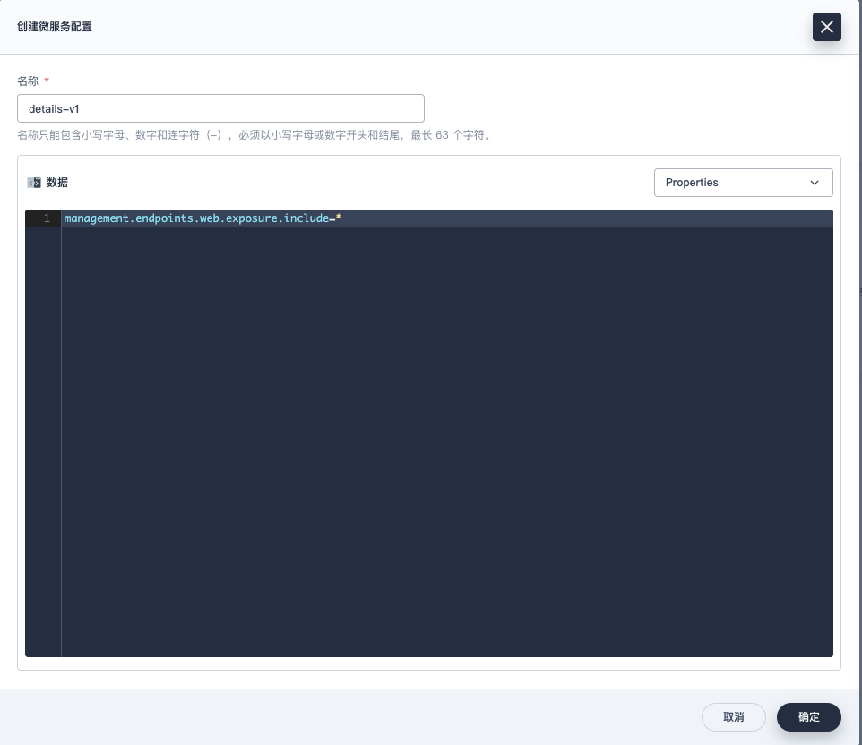

生成的 Data Id 格式是：**名称.文件类型**，这儿文件类型选择的 YAML 则 Data Id 为 details-v1.properties 和 reviews-v1.properties 。

在打包好的应用程序的 bootstrap.yml 中没有配置连接配置中心的 Data Id，默认会连接 `项目名.properties` 的 Data Id。


#### 一、productpage

是本示例中的前端访问入口，此前端项目不用在 Spring Cloud 微服务中部署，在【应用负载中部署成普通的工作负载】。

1. ##### 创建工作负载并通过环境变量指定网关地址

   填写镜像：若没有构建镜像可以用 `kubesphere/springcloud-bookinfo-productpage-v1:latest` demo ， 那么这儿我们也就填写对应的镜像地址。

   设置环境变量：（API_SERVER : http://springcloud-gateway.springcloud-demo.svc:8080）

   因为在前端项目中通过反向代理 访问 API 网关，通过环境变量配置 API 网关地址。网关我们下一步再部署，网关名字我们就设为 gateway、端口设为8080，那么这儿访问网关的地址就是  http://springcloud-gateway.springcloud-demo.svc:8080 。

   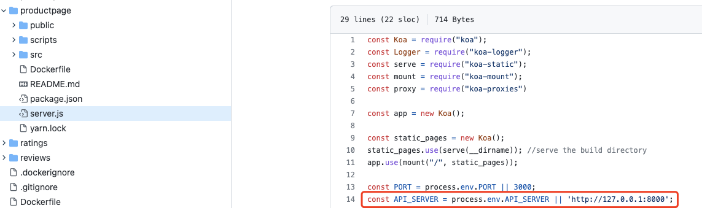

   

   

2. ##### 创建服务并指定工作负载

   因为这个服务是需要对外访问的前端应用，所以需要创建服务并设置成可以通过 NodePort 方式访问。

   创建服务时需要关联到对应的工作负载，并填写对应端口。（productpage 用的 3000 端口，通过应用路由访问配置80端口）

   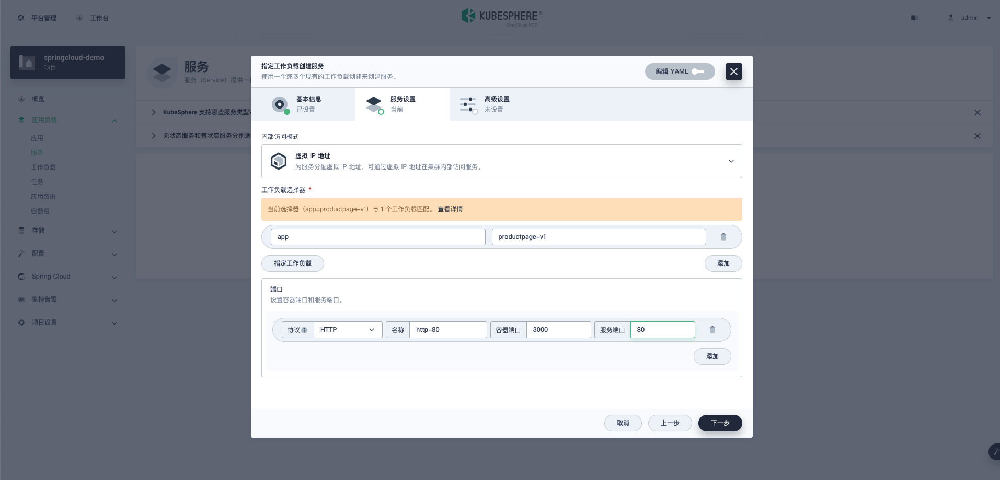

4. ##### 打开前端访问页面

   访问对应的 IP 和 NodePort 端口可以看到前端页面了，只是目前没有配置其他微服务，查看详情那些接口还请求不到数据。


#### 二、gateway

gateway 是一个 spring-cloud-gateway 应用，作为后端 API 的入口。这儿使用的网关是基于 springcloud 定制化的网关，在里面支持网关路由管理。

名称设置成 springcloud-gateway，因为前面 productpage 中配置的环境变量是这个，需要与之对应。

使用镜像：`registry.cn-beijing.aliyuncs.com/kse/spring-cloud-gateway:v0.1.0` 端口设置：容器端口和服务端口都为8080

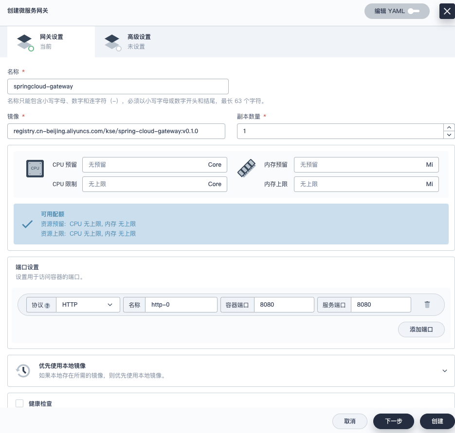

创建网关后会 apply 相应的 service 和 deployment。


#### 三、details

details 提供了具体的书籍详情 API，我们可以通过 product id 获取书籍的详细信息。这个是springcloud微服务，需要在【 Spring Cloud 微服务中部署】。

1. ##### 创建实例

   命名为：details-v1。（**注意：在创建实例命名微服务时，名字中不要出现下划线，否则会出现找不该服务的问题。**）

   填写镜像：若没有构建镜像可以用 `kubesphere/springcloud-bookinfo-datails-v1:v0.1.0` demo， 那么这儿我们也就填写对应的镜像地址。

   端口设置：设置8080端口

   **创建实例后，一般需要等会儿才可以看到服务注册上来。创建过程可在应用负载->工作负载中看到。**

   

1. ##### 在微服务网关中配置服务路由

   配置规则可参照 springcloud-gateway ，这儿主要配置以下几项：

   ```yaml
           - id: details-
             uri: lb://details-v1
             predicates:
               - Path=/api/v1/products/*
   ```

   注意 uri 中 lb://xxx ，这儿 xxx 是微服务的名字，**在创建实例命名微服务时，名字中不要出现下划线**，否则会出现找不该服务的问题。

   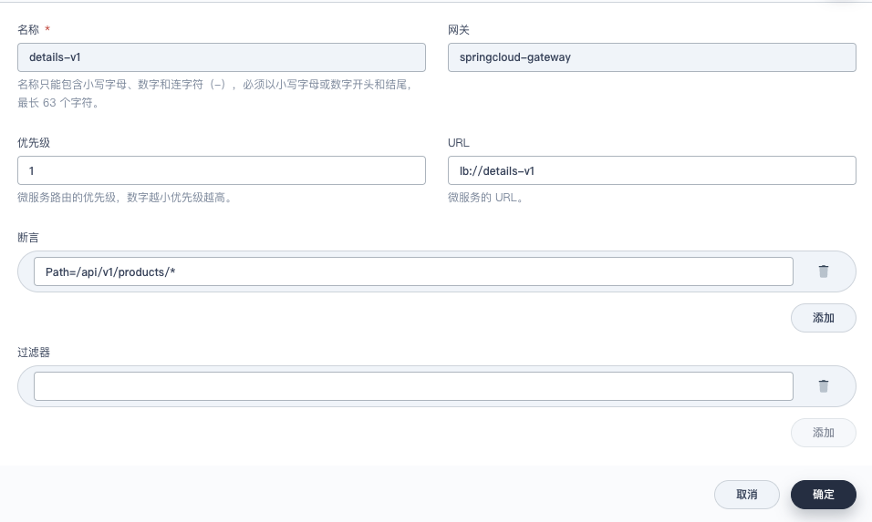

2. ##### 检查 productpage 中书籍详情是否正常显示

   可看到下面书籍详情页显示出来了。

   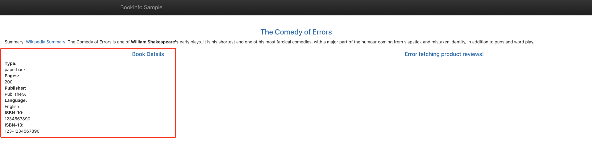


#### 四、reviews-v1

reviews 应用提供书籍评论相关的 API，可以通过配置开启是否展示评分。这个是springcloud微服务，需要在【 Spring Cloud 微服务中部署】

我们这儿部署 v1 版本的 reviews 后端服务，默认不展示书籍评分。

1. ##### 创建实例

   命名为：reviews-v1

   填写镜像：用 `kubesphere/springcloud-bookinfo-reviews-v1:v0.1.0` demo， 那么这儿我们也就填写对应的镜像地址。

   端口设置：设置8080端口

   

4. ##### 在微服务网关中配置服务路由

   配置规则可参照 springcloud-gateway ，这儿主要配置以下几项：

```
        - id: reviews-v1
          uri: lb://reviews-v1
          predicates:
            - Path=/api/v1/products/*/reviews
```


3. ##### 检查 productpage 中书籍评论是否正常显示

可看到下面书籍评论页显示出来了。

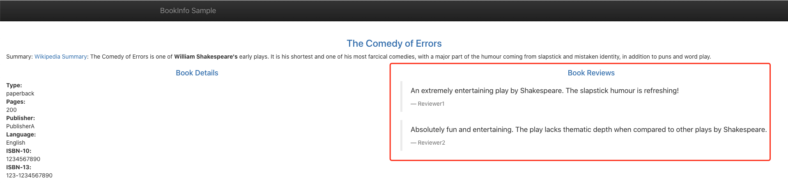


#### 五、reviews-v2

reviews-v2 用于演示灰度发布，相关 API 和 reviews-v1 一样，只是默认展示书籍评分。这个是springcloud微服务，需要在【 Spring Cloud 微服务中部署】

1. ##### 创建实例

   命名为：reviews-v2

   填写镜像：若没有构建镜像可以用`kubesphere/springcloud-bookinfo-reviews-v2:v0.1.0`demo。

   端口设置：设置8080端口

   

2. ##### 在微服务网关中配置服务路由

   配置规则可参照 springcloud-gateway ，这儿主要配置以下几项：

```
        - id: reviews-v2
          uri: lb://reviews-v2
          predicates:
            - Path=/api/v1/products/*/reviews
            - Weight=reviews, 50
```

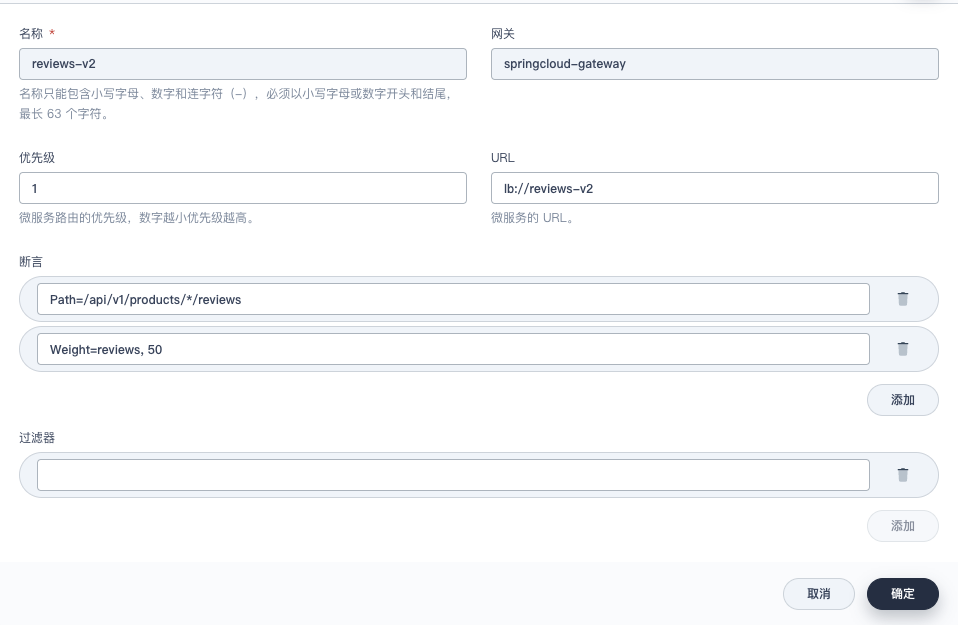

另外还需要更改服务路由中 reviews-v1 的配置，在谓词中加上 `Weight=reviews, 50` 。意思是 reviews-v1 和 reviews-v2 都位于 reviews 分组，同一分组下会按照给定的数值计算权重，即各占 `50/(50+50)` 50%。

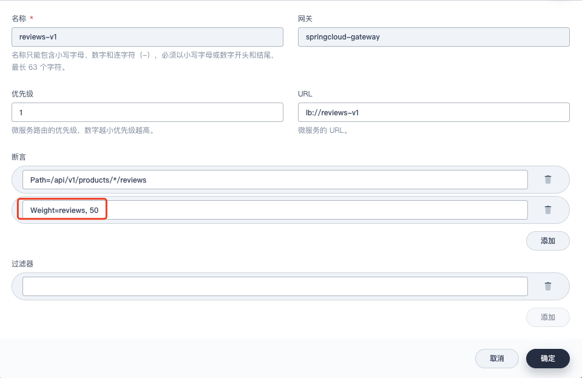

3. ##### 检查 productpage 中书籍评论是否正常显示

不断刷新页面，可以看到以下两种样式各占 50% 的概率。


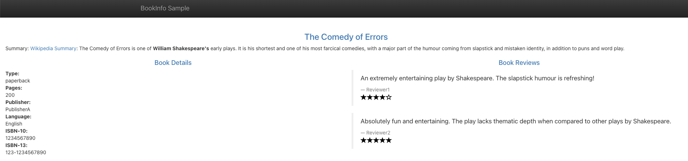

