# spring-cloud-bookinfo
Spring Cloud microservices demo coppied from Istio Bookinfo

以下是在 K8s 上安装 consul 并部署 spring-cloud-bookinfo 项目。


## 在 K8s 上安装 consul

可参照[官方文档](https://www.consul.io/docs/k8s/installation/install)，或按下面操作在 ks 上安装。

ks 上安装后[创建企业空间、项目、用户和平台角色](https://kubesphere.com.cn/docs/quick-start/create-workspace-and-project/)再进行下面操作。

### 一、添加应用仓库

工作空间管理员登录后，在应用管理中添加 consul 应用仓库[地址](https://www.consul.io/docs/k8s/installation/install#installing-consul)。`helm.releases.hashicorp.com`

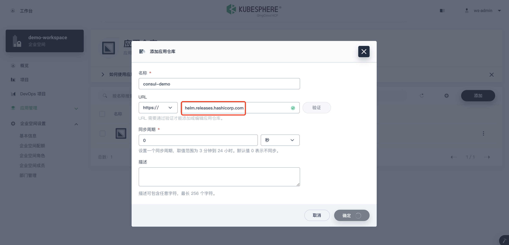

### 二、安装应用

在项目中点进 consul-demo 项目，进入 [应用负载] -> [应用] -> [创建应用] -> [从应用模版] -> [选择应用仓库] -> [选中刚添加的 consul-demo 应用仓库] -> [安装 consul]

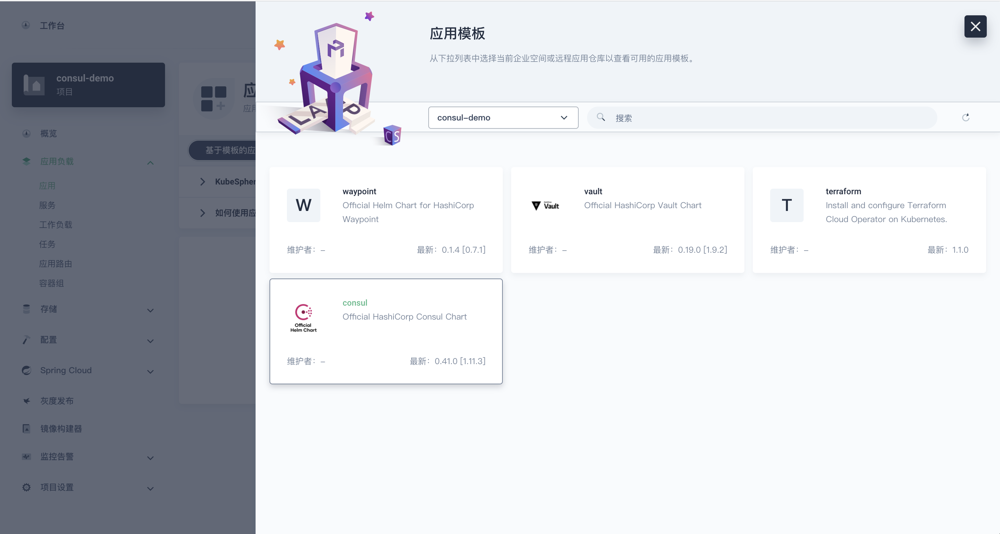


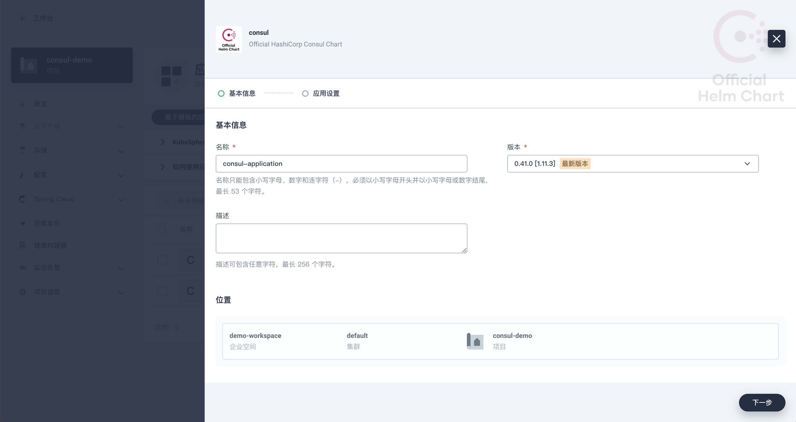


安装这个默认是 3 个副本，调度到3个节点上。如果节点数少于3，那么根据 consul 中的配置 consul server 会启动失败，可以到 consul server 应用负载处先把副本数置为零，编辑 yaml 把下面反亲和性的删掉，然后副本数再设为3。若有其他亲和性或反亲和性方案则自行按需求配置。

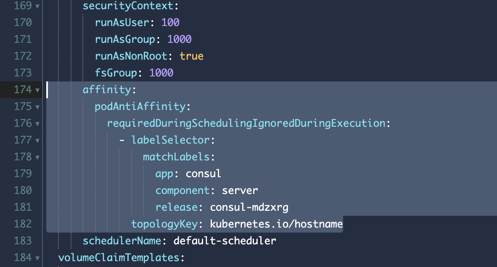

### 三、检查安装成功

等会儿可看到安装成功。

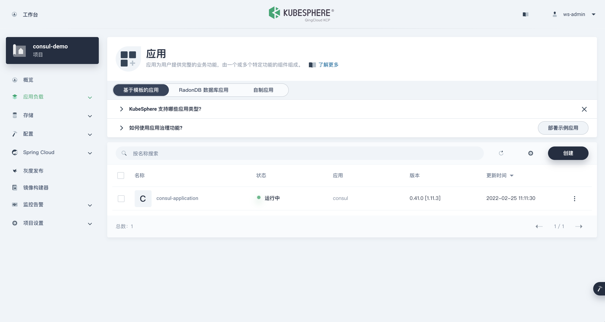

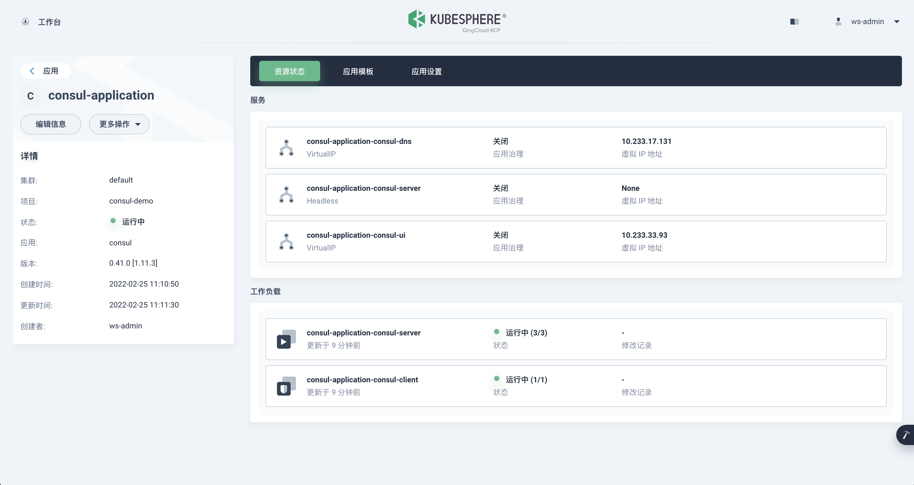

### 四、暴露 consul ui 

另外可以配置下应用路由（Ingress）把 consul ui 暴露出来。（注意：如果没有开启网关，需要先开启网关）

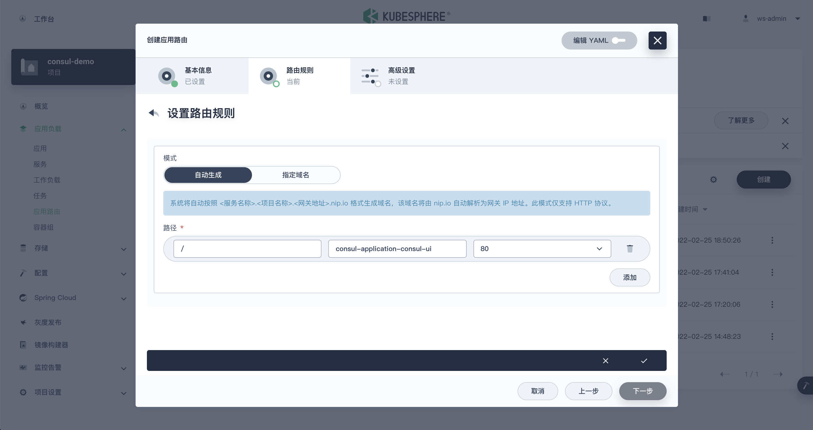

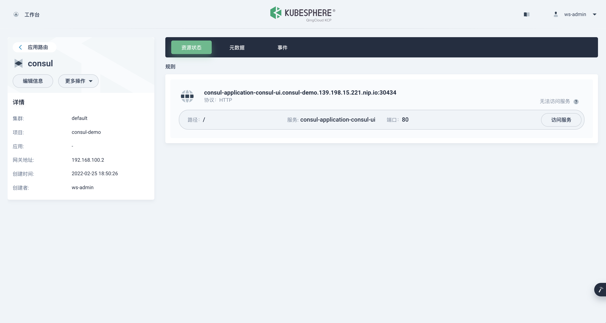

点进访问服务，就可以看到 consul ui 页面了。（如果访问出错则检查对应端口是否开放出来了）

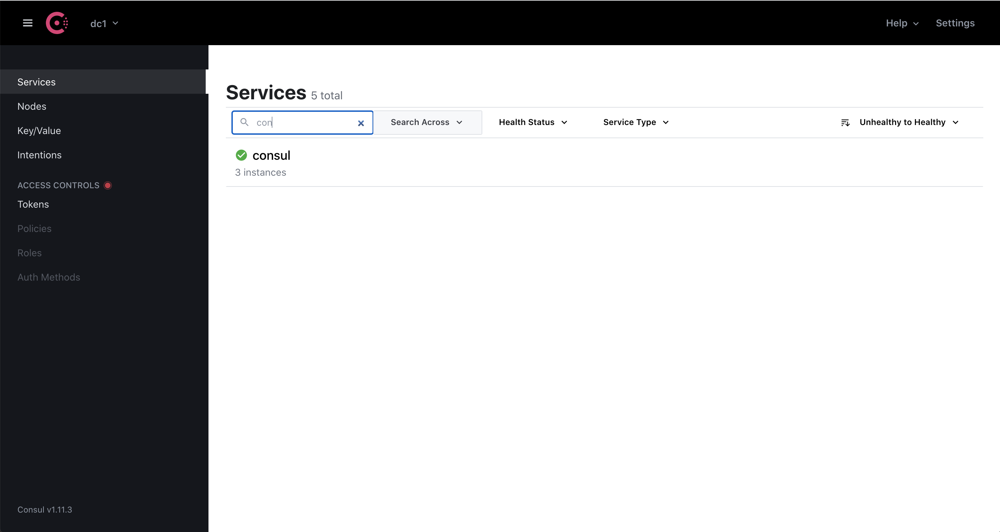


## 部署配置 bookinfo

大家可以从 GitHub 上查看这个 demo 项目

https://github.com/kubesphere-sigs/spring-cloud-bookinfo consul 分支

整个微服务应用中包含了 5 个组件

1. productpage 是一个由 react 开发的前端组件
2. gateway 是一个由 spring-cloud-gateway 提供的 API 网关服务
3. details 是一个 spring-cloud 微服务，提供了书籍详情 API
4. reviews-v1 提供了基础的书籍评论信息，review-v2 在 review-v1 的基础之上额外的提供了评分数据，依赖 ratings 服务
5. ratings 是一个 golang 开发的微服务组件


### 一、productpage

是一个 react 开发的前端项目，是本示例中的前端访问入口，先带大家了解一下项目结构

通过反向代理 访问 API 网关

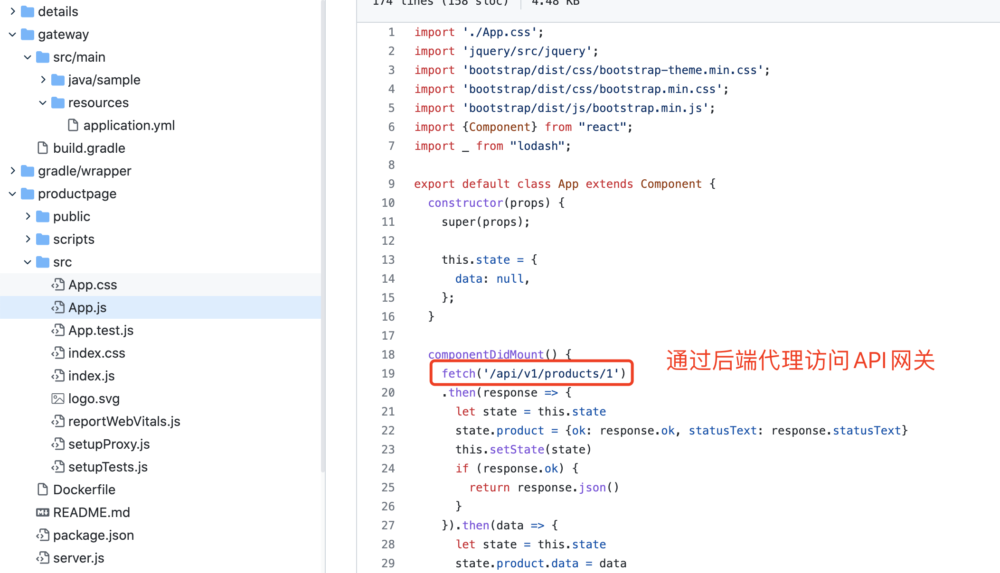

通过环境变量配置 API 网关地址

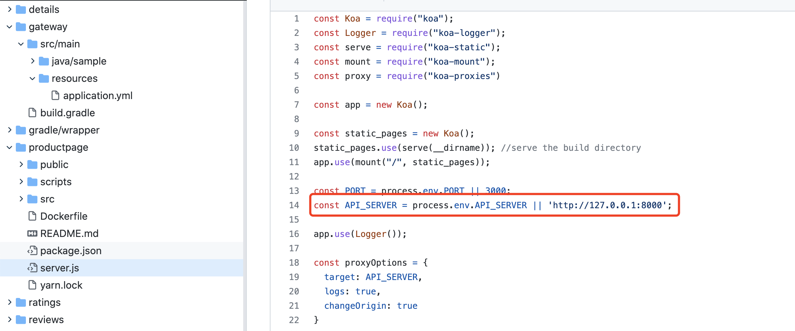


事先已经构建好了镜像，我们通过 kubesphere 进行部署

1. 创建工作负载并通过环境变量指定网关地址

   填写镜像、设置环境变量（API_SERVER : http://gateway.consul-demo.svc）

2. 创建服务并指定工作负载

   因为这个服务是需要对外访问的前端应用，所以需要创建服务并在后面需要通过应用路由暴露出来。

   创建服务时需要关联到对应的工作负载，并填写对应端口。（productpage 用的 3000 端口，通过应用路由访问配置80端口）

   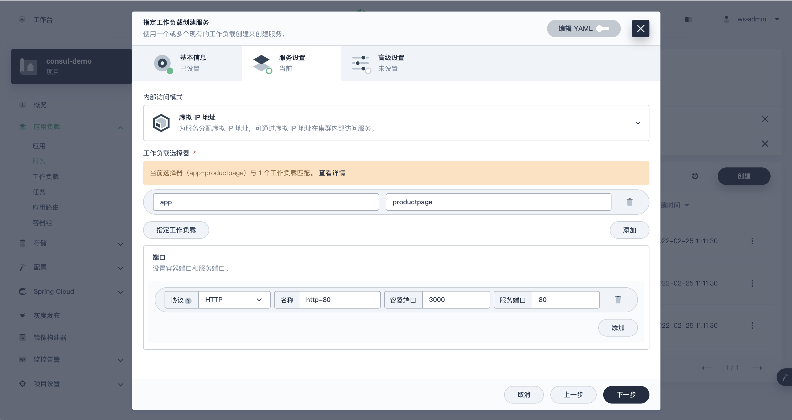

3. 开启项目网关，创建应用路由对外提供访问

   如果默认生成的内网的地址，那么自己需要改成外网地址并把对应的端口开发出来。

   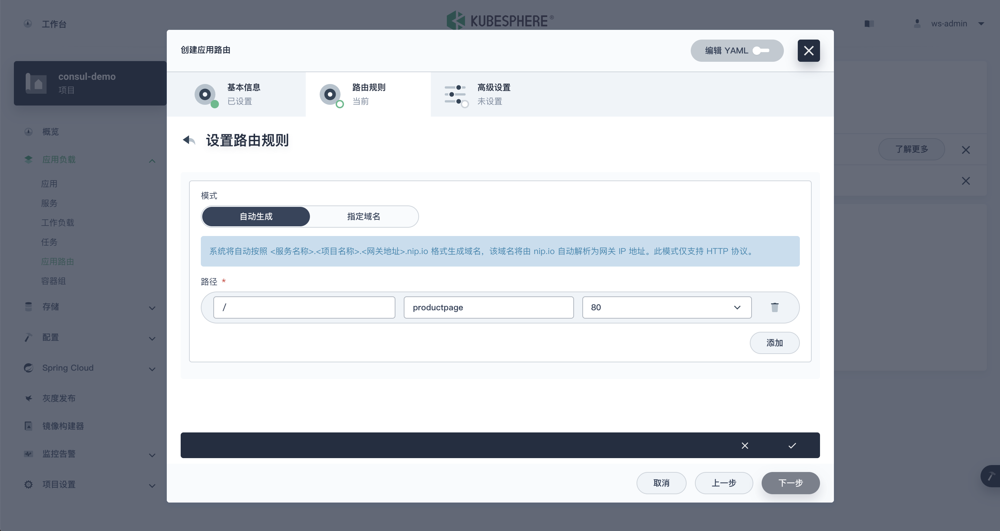

   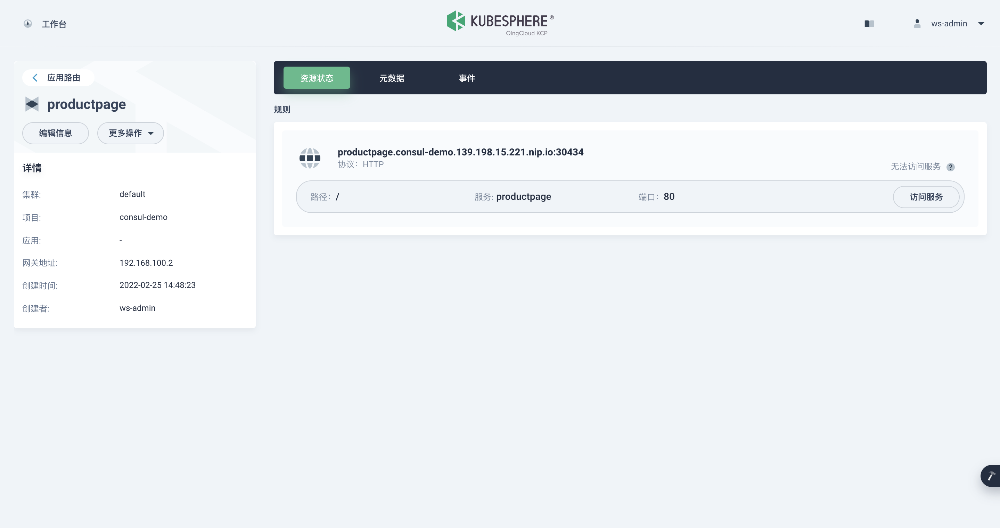

4. 打开前端访问页面

   可以看到能访问到前端页面了，只是目前没有配置其他微服务，查看详情那些接口还请求不到数据。


### 二、gateway

是一个 spring-cloud-gateway 应用，作为后端 API 的入口

添加相关依赖并启用 spring-cloud-gateway

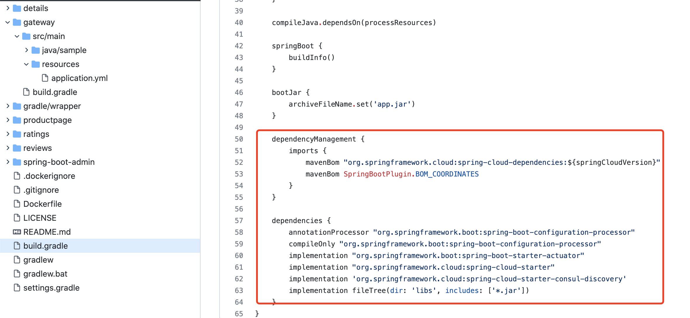

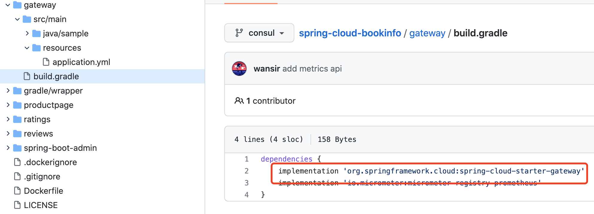

进行部署

1. 创建配置文件

   创建 configmap 把需要挂载的配置文件添加上，命名为 application.yml

   ```yaml
   server:
     port: ${SERVER_PORT:8080}
   spring:
     application:
       name: gateway
     cloud:
       consul:
         host: consul-application-consul-server.consul-demo.svc # 填对应 consul 地址
         port: 8500 # consul 默认端口
         discovery:
           prefer-ip-address: true # springcloud 中使用 consul 注册服务时默认使用的 hostname ，需要换成IP
       gateway:
         routes: []
   
   management:
     endpoints:
       web:
         exposure:
           include: "*"
   ```

   

   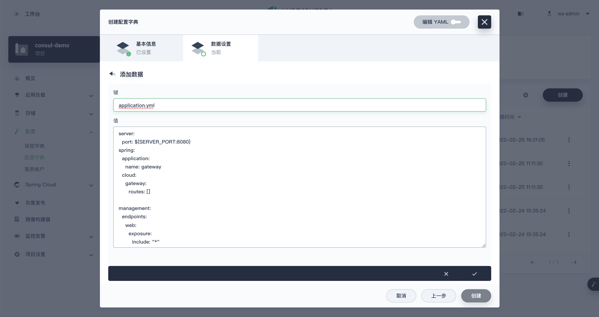

2. 创建工作负载

   填写镜像、挂载configmap（注意把 configmap 挂载到 WOKRDIR 下的 config 目录下（这儿挂载到 /app/config ））

3. 创建服务

   因为网关也是需要暴露出来让前端接口访问的，所以这儿也是需要创建服务，然后通过应用路由暴露。

   关联刚刚创建的工作负载，并设定端口（容器端口8080，服务端口80）

   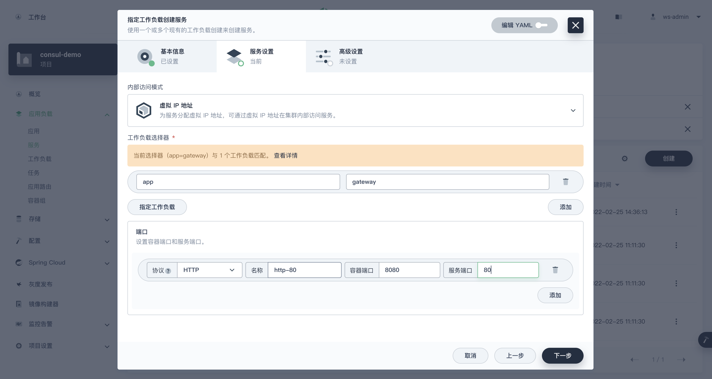

4. 创建应用路由

   关联上面创建的服务，完成创建。

   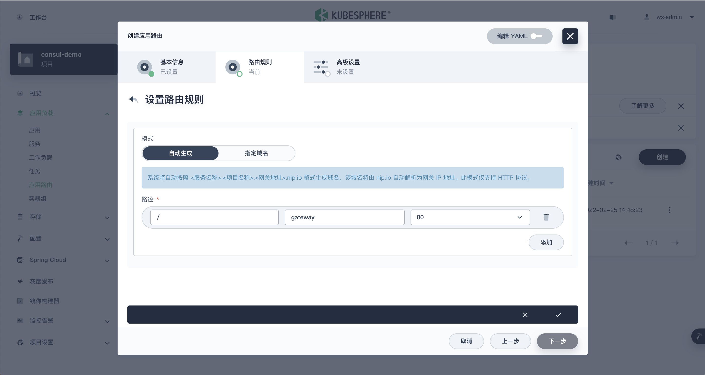

5. 打开访问页面

   /actuator/gateway/routes   （路由表接口）


### 三、spring-boot-admin

可以借助 spring-boot-admin 管理我们的微服务应用。

进行部署

1. 创建配置文件

   application.yml

   ```yaml
   server:
     port: ${SERVER_PORT:8080}
   spring:
     application:
       name: spring-boot-admin
     cloud:
       consul:
         host: consul-application-consul-server.consul-demo.svc # 填对应 consul 地址
         port: 8500 # consul 默认端口
         discovery:
           prefer-ip-address: true # springcloud 中使用 consul 注册服务时默认使用的 hostname ，需要换成IP
   ```
   
   
   
2. 创建工作负载

   填镜像、挂载配置文件（挂载到 /app/config ），完成创建

3. 创建服务

   容器端口8080、服务端口80

4. 创建应用路由

5. 打开访问页面，检查前面部署的 gateway 是否正常注册

   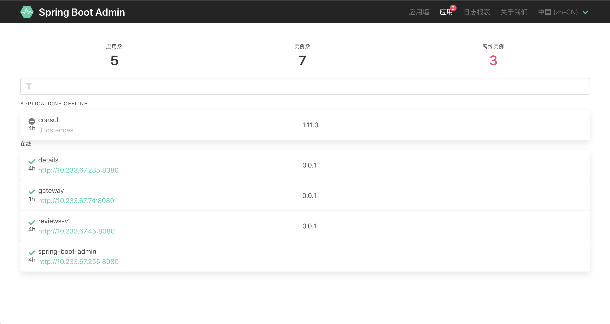

### 四、details

details 提供了具体的书籍详情 API，我们可以通过 product id 获取书籍的详细信息。

部署 details 应用

1. 创建配置文件

   ```yaml
   server:
     port: ${SERVER_PORT:8080}
   spring:
     application:
       name: details
     cloud:
       consul:
         host: consul-application-consul-server.consul-demo.svc # 填对应 consul 地址
         port: 8500 # consul 默认端口
         discovery:
           prefer-ip-address: true # springcloud 中使用 consul 注册服务时默认使用的 hostname ，需要换成IP
   
   management:
     endpoints:
       web:
         exposure:
           include: "*"
   ```

   

2. 创建工作负载

   填镜像、暴露端口（8080）、挂载配置文件（挂载到 /app/config ）。（这个微服务不需要暴露到外面访问就不用在里面创建服务和应用路由了）

3. 打开 spring-boot-admin 检查服务是否正常注册

4. 通过 spring-boot-admin 在 gateway 配置路由规则/或在gateway的configmap中配置

   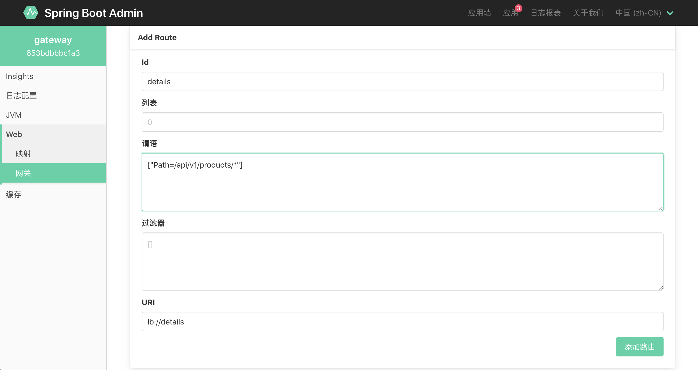

   ```yaml
           - id: details
             uri: lb://details
             predicates:
               - Path=/api/v1/products/*
   ```

   注意：添加路由后记得刷新路由缓存。

5. 检查路由规则是否生效

   ```yaml
   /api/v1/products/1
   ```

6. 检查 productpage 中书籍详情是否正常显示

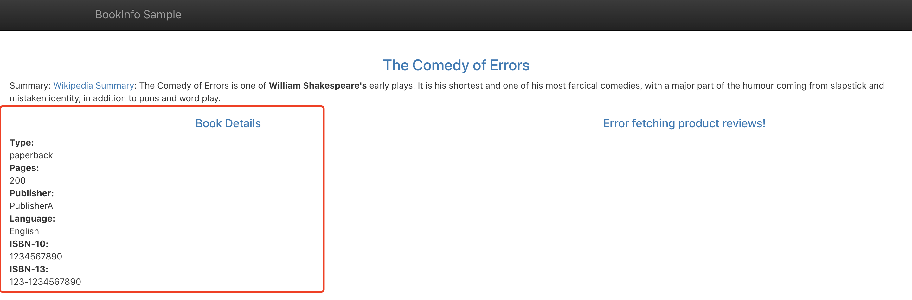


### 五、reviews-v1

reviews 应用提供书籍评论相关的 API，可以通过配置开启是否展示评分

我们先部署 v1 版本的 reviews 后端服务，默认不展示书籍评分

1. 创建配置文件： 注意禁用评分功能

   ```yaml
   server:
     port: ${SERVER_PORT:8080}
   spring:
     application:
       name: reviews
     cloud:
       consul:
         host: consul-application-consul-server.consul-demo.svc
         port: 8500
         discovery:
           prefer-ip-address: true # springcloud 中使用 consul 注册服务时默认使用的 hostname ，需要换成IP
   
   ratings:
     enabled: false
     color: black
   
   management:
     endpoints:
       web:
         exposure:
           include: "*"
   ```

2. 创建工作负载

   填写镜像、暴露端口（8080）、挂载配置文件（挂载到 /app/config ）

3. 打开 spring-bootadmin 检查服务是否正常注册

4. 通过 spring-boot-admin 在 gateway 配置路由规则

   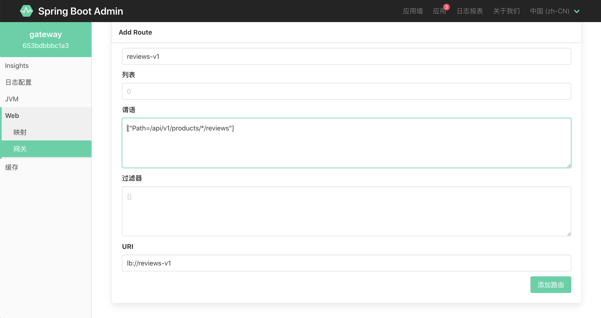

```
        - id: reviews-v1
          uri: lb://reviews-v1
          predicates:
            - Path=/api/v1/products/*/reviews
```

5. 检查路由规则是否生效

```
/api/v1/products/1/reviews
```

6. 检查 productpage 中书籍评论是否正常显示

   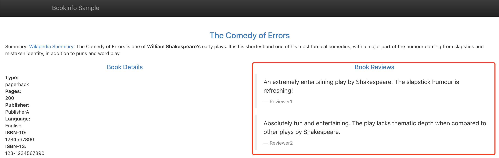


## 同步 K8s 服务到 consul

以上示例主要适用于基于 spring-cloud-consul 使用 consul ，若一个项目中还有其他其他语言开发的微服务注册到 consul ，或者部署到 K8s 集群上不想用 consul client SDK ，则可以在配置 consul 时让 K8s 中的服务同步 consul 。

在 K8s 上通过 Helm 安装 consul 注意配置同步相关配置项，主要如下所示，详情参考[官方文档](https://www.consul.io/docs/k8s/service-sync)。

```yaml
syncCatalog:
  # 是否开启同步，默认 false
  enabled: true
  # 是否将服务从 K8s 同步到 consul
  toConsul: true
  # 是否将服务从 consul 同步到 K8s
  toK8S: true
  # 允许同步的 namespace
  k8sAllowNamespaces: ["consul-demo"]
```

各个配置项含义及默认值，见[官方文档](https://www.consul.io/docs/k8s/helm#v-synccatalog)。

---


接上面部署的服务，接下来部署一个其他语言开发的服务并对服务进行调用。

### 六、ratings

review-v2 为书籍提供更详细的评论信息，包含评分数据，依赖 ratings 提供评分相关的数据。

ratings 是一个简单的 golang 开发的应用。

1. 创建工作负载

   填写镜像（这儿不用指定端口、挂载配置文件）

2. 创建服务

   端口（容器端口8080，服务端口80）创建完后也可通过 consul ui 看到同步到 consul 中的服务。

   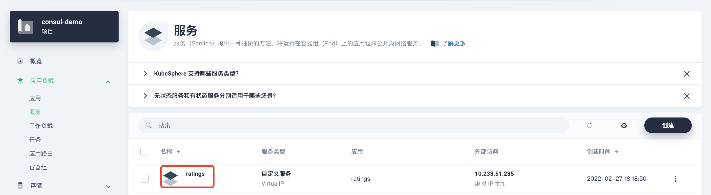

   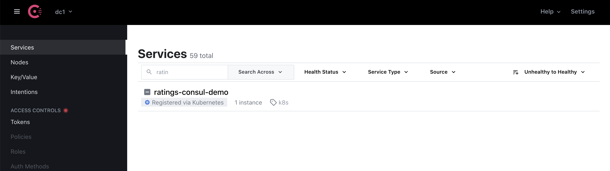

3. 通过 spring-boot-admin 在 gateway 配置路由规则

```
        - id: ratings
          uri: lb://ratings
          predicates:
            - Path=/api/v1/reviews/*/ratings
```

4. 检查路由规则是否生效

```
/api/v1/reviews/1/ratings
```


### 七、reviews-v2

reviews-v2 依赖于 ratings 微服务获取评分数据，可以检测是否能成功调用到 ratings 微服务。

另外通过 spring-cloud-gateway 的 WeightRoutePredicateFactory 实现简单的灰度发布，根据不同的版本配置流量权重。

创建 v2 版本的 reviews 服务

1. 创建配置文件： 注意启用 ratings

   ```yaml
   server:
     port: ${SERVER_PORT:8080}
   spring:
     application:
       name: reviews-v2
     cloud:
       consul:
         host: consul-application-consul-server.consul-demo.svc
         port: 8500
         discovery:
           prefer-ip-address: true # springcloud 中使用 consul 注册服务时默认使用的 hostname ，需要换成IP
   
   
   ratings:
     enabled: true
     server-addr: http://ratings-consul-demo # 填 consul 中对应的服务名称
     color: red
   
   management:
     endpoints:
       web:
         exposure:
           include: "*"
   ```

2. 创建工作负载

   填镜像、暴露端口（8080）、挂载配置文件（挂载到 /app/config ）。（这个微服务不需要暴露到外面访问就不用在里面创建服务和应用路由了）

3. 通过 spring-boot-admin 检查服务是否正常注册

4. 通过 spring-boot-admin 在 gateway配置路由规则，v1、v2 各占一半的权重

```
        - id: reviews-v1
          uri: lb://reviews-v1
          predicates:
            - Path=/api/v1/products/*/reviews
            - Weight=reviews, 50
        - id: reviews-v2
          uri: lb://reviews-v2
          predicates:
            - Path=/api/v1/products/*/reviews
            - Weight=reviews, 50
```

5. 打开 productpage ，刷新界面，预期 review-v1/review-v2 的概率各占一半，看到有评分数据可以知道 review-v2 能正常调用 ratings 微服务

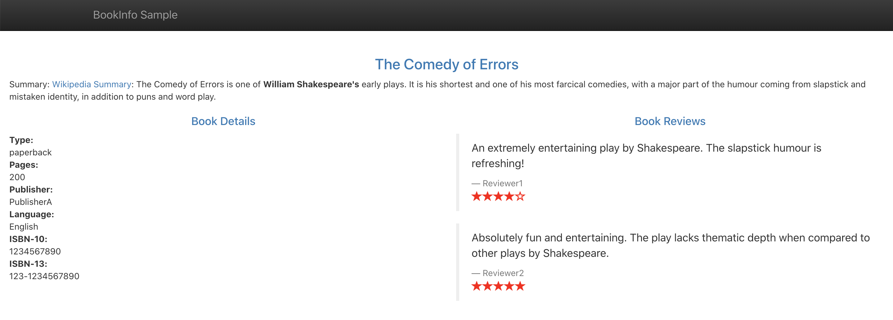


## 总结

spring-cloud-consul 简化了 K8s 环境下 spring-cloud 应用的组件依赖，提供了开箱即用的服务发现能力，为 java 微服务应用提供了良好的基础。

如果在多语言开发的微服务环境下，可以选择 K8s 与 consul 同步服务的配置的方式，为多语言微服务集成提供了基础。


附：

[spring-cloud-consul git](https://github.com/spring-cloud/spring-cloud-consul)

[spring-cloud-consul docs](https://docs.spring.io/spring-cloud-consul/docs/current/reference/html/) 

[spring-cloud-consul various properties](https://cloud.spring.io/spring-cloud-consul/reference/html/appendix.html)

